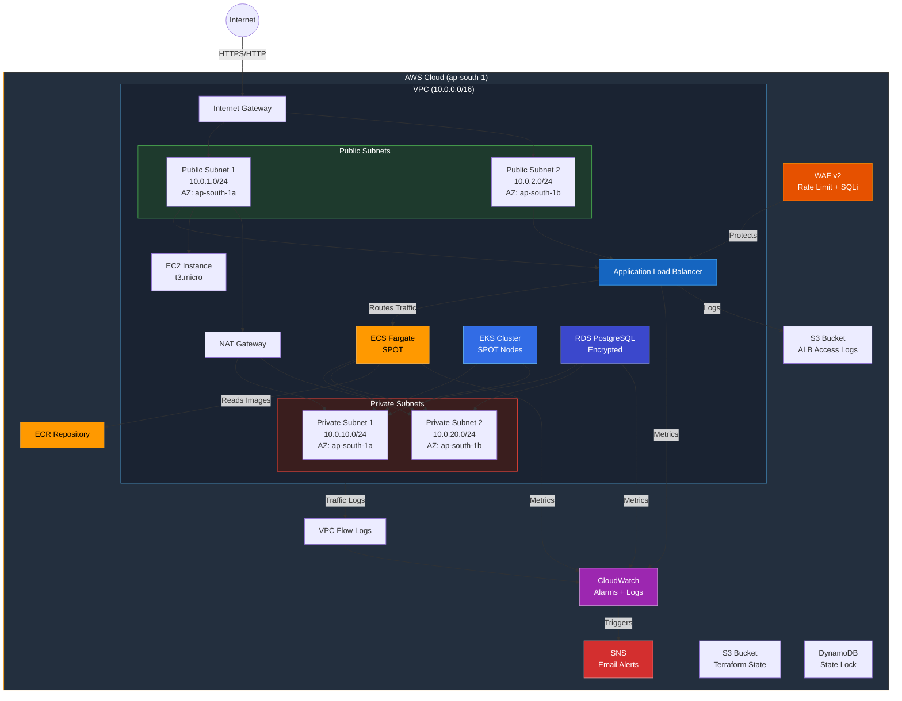
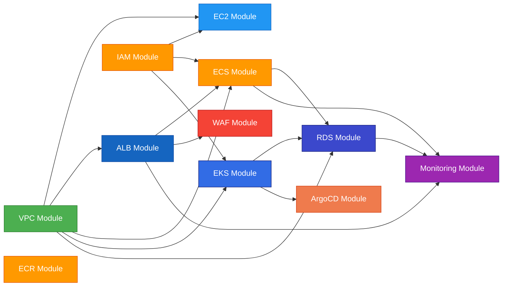
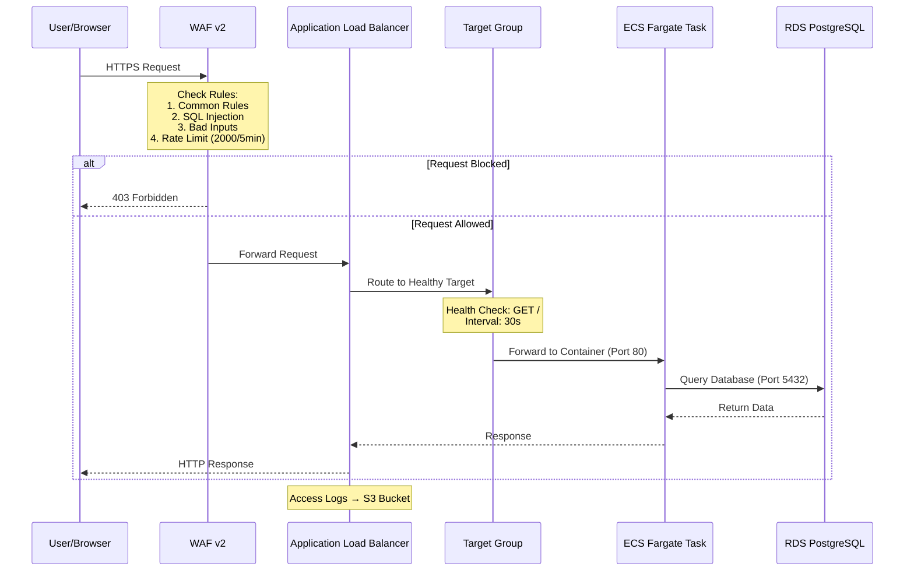
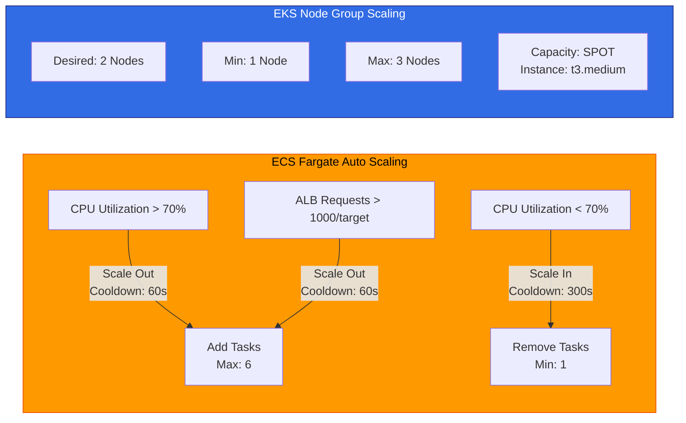
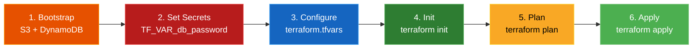

# AWS Infrastructure with Terraform

Production-grade AWS infrastructure template built with Terraform using a modular architecture. Deploys a complete environment including networking, compute, container orchestration, database, security, and monitoring — all in the `ap-south-1` (Mumbai) region.


---

## Architecture Overview

### Infrastructure Diagram



### Module Dependency Graph

Shows how Terraform modules depend on each other:



### Request Flow (How Traffic Reaches Your App)



### CI/CD Pipeline Flow

```mermaid
flowchart LR
    subgraph Trigger["Trigger"]
        PUSH["Push to main"]
        PR["Pull Request"]
    end

    subgraph Lint["Job 1: Lint"]
        FMT["terraform fmt<br/>--check"]
        INIT1["terraform init<br/>--backend=false"]
        VAL["terraform validate"]
        COMMENT1["Post PR Comment<br/>Format + Validate Results"]
    end

    subgraph Security["Job 2: Security Scan"]
        TFSEC["tfsec<br/>Static Analysis"]
        CHECKOV["Checkov<br/>Policy Check"]
    end

    subgraph Plan["Job 3: Plan (PRs only)"]
        INIT2["terraform init"]
        PLAN["terraform plan<br/>--out=tfplan"]
        COMMENT2["Post Plan Output<br/>to PR Comment"]
    end

    subgraph Apply["Job 4: Apply (main only)"]
        INIT3["terraform init"]
        PLAN2["terraform plan<br/>--out=tfplan"]
        APPLY["terraform apply<br/>--auto-approve"]
    end

    PUSH & PR --> FMT --> INIT1 --> VAL --> COMMENT1
    COMMENT1 --> TFSEC --> CHECKOV

    CHECKOV -->|PR| INIT2 --> PLAN --> COMMENT2
    CHECKOV -->|Push to main| INIT3 --> PLAN2 --> APPLY

    style Trigger fill:#424242,stroke:#757575,color:#fff
    style Lint fill:#1565C0,stroke:#42A5F5,color:#fff
    style Security fill:#E65100,stroke:#FF9800,color:#fff
    style Plan fill:#2E7D32,stroke:#66BB6A,color:#fff
    style Apply fill:#B71C1C,stroke:#EF5350,color:#fff
```



### Security Layers

```mermaid
graph TB
    subgraph Layer1["Layer 1: Edge Security"]
        WAF["WAF v2<br/>Rate Limiting (2000 req/5min)<br/>SQL Injection Protection<br/>Common Attack Rules<br/>Bad Input Blocking"]
    end

    subgraph Layer2["Layer 2: Network Security"]
        SG_ALB["ALB Security Group<br/>Ports: 80, 443"]
        SG_EC2["EC2 Security Group<br/>SSH: Restricted by CIDR<br/>HTTP/HTTPS: Open"]
        SG_ECS["ECS Security Group<br/>Traffic from ALB only"]
        SG_EKS["EKS Security Group<br/>API: Restricted by CIDR<br/>Internal: Self"]
        SG_RDS["RDS Security Group<br/>Port 5432: ECS + EKS only"]
    end

    subgraph Layer3["Layer 3: Instance Security"]
        IMDS["IMDSv2 Required<br/>on EC2"]
        ENC_EBS["EBS Encryption<br/>on EC2"]
        ENC_RDS["Storage Encryption<br/>on RDS"]
        ENC_S3["AES256 Encryption<br/>on S3 Buckets"]
        DEL_PROT["Deletion Protection<br/>on Prod RDS"]
    end

    subgraph Layer4["Layer 4: Access Control"]
        IAM_EC2["EC2 Role<br/>SSM Access Only"]
        IAM_ECS["ECS Roles<br/>Execution + Task"]
        IAM_EKS["EKS Roles<br/>Cluster + Node"]
        NO_PUB["S3 Public Access<br/>Blocked"]
    end

    subgraph Layer5["Layer 5: Monitoring"]
        FLOW["VPC Flow Logs"]
        ALB_LOGS["ALB Access Logs"]
        CW_ALARMS["CloudWatch Alarms (8)"]
        SNS_ALERT["SNS Email Alerts"]
    end

    Layer1 --> Layer2 --> Layer3 --> Layer4 --> Layer5

    style Layer1 fill:#B71C1C,stroke:#EF5350,color:#fff
    style Layer2 fill:#E65100,stroke:#FF9800,color:#fff
    style Layer3 fill:#F9A825,stroke:#FDD835,color:#000
    style Layer4 fill:#1565C0,stroke:#42A5F5,color:#fff
    style Layer5 fill:#2E7D32,stroke:#66BB6A,color:#fff
```



### Auto Scaling Behavior



---

## What Gets Created

| Module | Resources |
|--------|-----------|
| **VPC** | VPC, 2 Public Subnets, 2 Private Subnets, Internet Gateway, NAT Gateway, Elastic IP, Route Tables, VPC Flow Logs |
| **IAM** | EC2 Role + SSM + Instance Profile, ECS Execution & Task Roles, EKS Cluster & Node Roles |
| **EC2** | Hardened EC2 Instance (IMDSv2, encrypted EBS, restricted SSH, detailed monitoring) |
| **ALB** | Application Load Balancer, Target Group, HTTP Listener, Access Logs to S3 |
| **ECS** | Fargate Cluster (SPOT), Task Definition, Service, Auto Scaling (CPU + Request Count), CloudWatch Logs |
| **EKS** | EKS Cluster (full logging), Managed Node Group (SPOT), Restricted API access |
| **WAF** | Web ACL with Common Rules, SQL Injection, Bad Inputs, Rate Limiting |
| **RDS** | PostgreSQL with backups, Performance Insights, encrypted storage, deletion protection (prod) |
| **ECR** | Container registry with image scanning, encryption, lifecycle cleanup policies |
| **Monitoring** | 8 CloudWatch Alarms (ECS/RDS/ALB) + SNS email alerts |
| **ArgoCD** | Helm release of ArgoCD into the EKS cluster |

## Project Structure

```
terraform/
├── main.tf                 # Root module – calls all sub-modules
├── variables.tf            # Input variable definitions
├── outputs.tf              # Output values after apply
├── providers.tf            # AWS provider & Terraform settings
├── backend.tf              # Remote state config (S3 + DynamoDB)
├── terraform.tfvars        # Variable values (gitignored – sensitive)
├── terraform.tfvars.example# Safe reference for terraform.tfvars
├── .gitignore              # Ignores .terraform/, *.tfstate, *.tfvars
├── .github/
│   └── workflows/
│       └── terraform.yml   # CI/CD pipeline (Lint → Security → Plan → Apply)
├── bootstrap/
│   └── main.tf             # Creates S3 bucket + DynamoDB for state backend
└── modules/
    ├── vpc/                # Networking (VPC, subnets, NAT, flow logs)
    ├── iam/                # IAM roles & policies
    ├── ec2/                # Compute instance (hardened)
    ├── alb/                # Load balancer + access logs
    ├── ecs/                # ECS Fargate (auto-scaling)
    ├── eks/                # Kubernetes (EKS)
    ├── waf/                # Web Application Firewall
    ├── rds/                # PostgreSQL database
    ├── ecr/                # Container registry
    ├── monitoring/         # CloudWatch alarms + SNS
    └── argocd/             # ArgoCD GitOps via Helm
```

## Prerequisites

- [Terraform](https://developer.hashicorp.com/terraform/downloads) >= 1.5.0
- [AWS CLI](https://aws.amazon.com/cli/) configured with valid credentials
- An existing EC2 Key Pair in `ap-south-1` (update `ec2_key_name` in `terraform.tfvars`)

```bash
aws configure
# Access Key ID:     <your-key>
# Secret Access Key: <your-secret>
# Default Region:    ap-south-1
```

## Quick Start

### Setup Flow



### Step 1: Bootstrap State Backend

Create the S3 bucket and DynamoDB table for remote state:

```bash
cd bootstrap
terraform init
terraform apply
cd ..
```

### Step 2: Set Sensitive Variables

```bash
# Set your database password (never put in tfvars)
export TF_VAR_db_password="YourStrongP@ssword123!"
```

### Step 3: Configure Variables

Copy the example file and customize:

```bash
cp terraform.tfvars.example terraform.tfvars
```

Edit `terraform.tfvars` with your values (SSH CIDR, EKS CIDR, alert email, etc.)

### Step 4: Deploy

```bash
terraform init       # Initialize (downloads providers & modules)
terraform plan       # Preview changes
terraform apply      # Deploy everything
```

### Step 5: Clean Up

```bash
terraform destroy    # Destroy all resources
```

## Configuration

All values can be customized in `terraform.tfvars`:

| Variable | Default | Description |
|----------|---------|-------------|
| `aws_region` | `ap-south-1` | AWS region |
| `project_name` | `my-aws-infra` | Prefix for resource names |
| `environment` | `dev` | Environment tag (dev, staging, prod) |
| `vpc_cidr` | `10.0.0.0/16` | VPC CIDR block |
| `ec2_instance_type` | `t3.micro` | EC2 instance size |
| `ec2_key_name` | `my-key-pair` | SSH key pair name |
| `allowed_ssh_cidr` | `[]` (disabled) | CIDRs allowed to SSH into EC2 |
| `allowed_eks_cidr` | `["10.0.0.0/16"]` | CIDRs allowed to access EKS API |
| `ecs_container_image` | `nginx:latest` | ECS Fargate container image |
| `ecs_desired_count` | `2` | Number of ECS tasks |
| `eks_cluster_version` | `1.29` | Kubernetes version |
| `eks_node_instance_type` | `t3.medium` | EKS worker node size |
| `db_password` | *(set via env var)* | RDS master password |
| `alert_email` | `""` | Email for CloudWatch alarm notifications |
| `ecr_image_tag_mutability` | `MUTABLE` | ECR tag mutability |

## Security Features

| Feature | Details |
|---------|---------|
| **SSH Restricted** | Disabled by default. Set `allowed_ssh_cidr` to enable for specific IPs |
| **EKS API Restricted** | Configurable via `allowed_eks_cidr` |
| **IMDSv2 Required** | EC2 instance requires token-based metadata access |
| **WAF Protection** | Common rules, SQL injection, bad inputs, rate limiting (2000 req/5min) |
| **Encrypted Storage** | RDS and EC2 EBS volumes encrypted at rest |
| **No Plain Text Secrets** | DB password set via environment variable, `*.tfvars` gitignored |
| **VPC Flow Logs** | All traffic logged to CloudWatch |
| **ALB Access Logs** | Request logs stored in S3 (encrypted, lifecycle managed) |
| **S3 Public Access Blocked** | All S3 buckets block public access |

## Monitoring & Alerts

8 CloudWatch alarms with SNS email notifications:

| Alarm | Metric | Threshold |
|-------|--------|-----------|
| ECS CPU High | CPUUtilization | > 80% |
| ECS Memory High | MemoryUtilization | > 80% |
| RDS CPU High | CPUUtilization | > 80% |
| RDS Low Storage | FreeStorageSpace | < 5 GB |
| RDS Connections High | DatabaseConnections | > 50 |
| ALB 5xx Errors | HTTPCode_ELB_5XX_Count | > 10/5min |
| ALB Target 5xx | HTTPCode_Target_5XX_Count | > 10/5min |
| ALB Unhealthy Hosts | UnHealthyHostCount | > 0 |

Set `alert_email` in `terraform.tfvars` to receive notifications.

## CI/CD Pipeline

GitHub Actions workflow (`.github/workflows/terraform.yml`):

| Job | Trigger | What It Does |
|-----|---------|--------------|
| **Lint** | All pushes & PRs | Format check, init, validate |
| **Security** | After lint passes | tfsec + Checkov scans |
| **Plan** | PRs only | Runs `terraform plan`, posts output to PR |
| **Apply** | Push to `main` | Runs `terraform apply` in production environment |

### Required GitHub Secrets

| Secret | Description |
|--------|-------------|
| `AWS_ACCESS_KEY_ID` | AWS access key |
| `AWS_SECRET_ACCESS_KEY` | AWS secret key |
| `DB_PASSWORD` | RDS database password |

## Useful Commands

```bash
terraform fmt             # Auto-format .tf files
terraform validate        # Validate configuration
terraform output          # View outputs
terraform state list      # List managed resources
terraform plan -destroy   # Preview destruction
```

## Cost Estimate

> **Warning** — These resources incur charges. Always destroy when done testing.

| Resource | Hourly Cost | Monthly Estimate |
|----------|------------|-----------------|
| NAT Gateway | ~$0.045 | ~$32 |
| ALB | ~$0.0225 | ~$16 |
| EC2 (t3.micro) | ~$0.0104 | ~$7.50 |
| ECS Fargate (SPOT) | ~$0.01/task | ~$15 |
| EKS Cluster | ~$0.10 | ~$73 |
| EKS Nodes (t3.medium SPOT) | ~$0.02/each | ~$15/each |
| RDS (db.t3.micro) | ~$0.017 | ~$12 |

**Total estimate: ~$185–220/month** if left running.

```bash
# ALWAYS clean up after practicing
terraform destroy
```

---

**Built with Terraform** · Region: `ap-south-1` (Mumbai) · 11 Modules · Production-Ready Template
